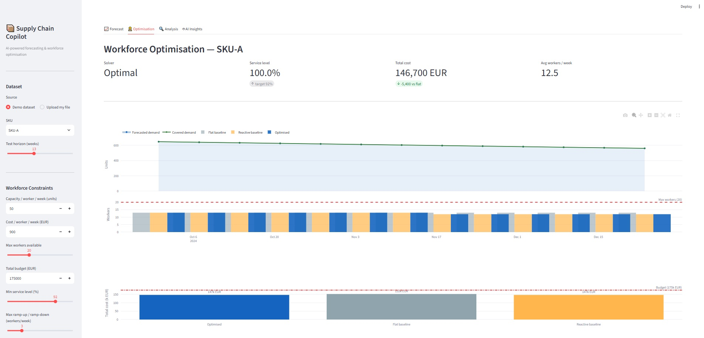
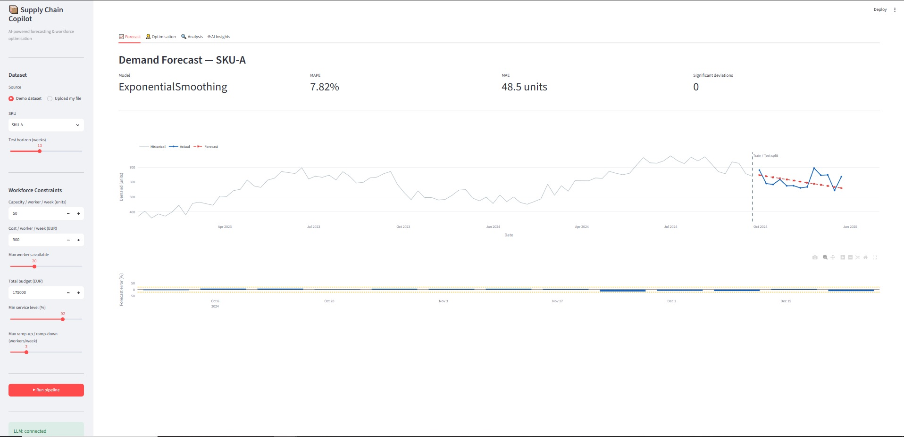
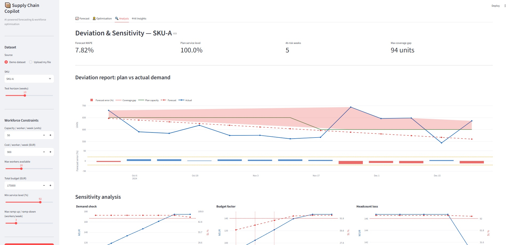
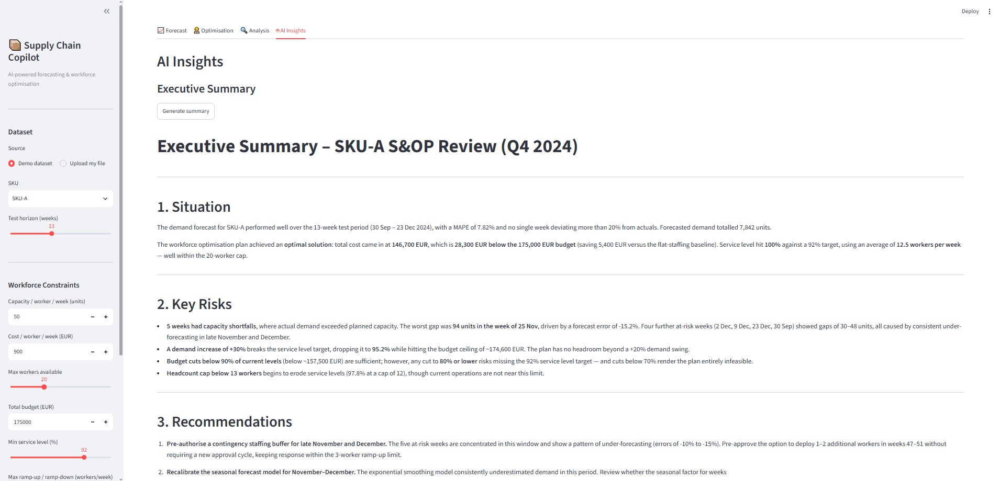
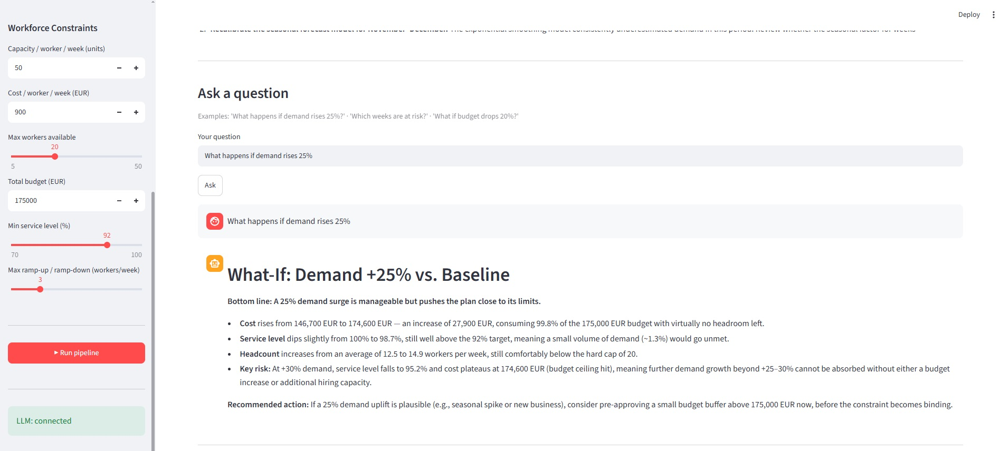
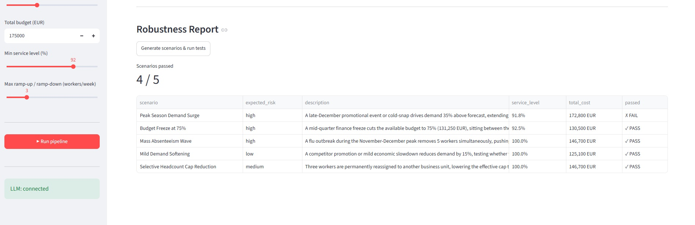

# AI Supply Chain Copilot

🇬🇧 English · [🇫🇷 Français](#-français)

> **An AI copilot that turns raw sales data into a forecast, a staffing plan and a plain-English explanation — in minutes, on any CSV or Excel file.**
>
> **AI & LLM skills:** Claude API integration · prompt engineering · structured (JSON) LLM output · natural language → optimisation constraints · LLM-assisted schema detection · model routing (Haiku / Sonnet) · AI-generated documentation · secure API-key handling
>
> **Supply chain & data skills:** demand forecasting (Holt-Winters, SARIMA, moving average) · forecast accuracy (MAPE / MAE / RMSE) · workforce & capacity planning · linear / mixed-integer programming (PuLP) · sensitivity & scenario analysis · service-level vs. cost trade-offs · data cleaning & PII removal · pandas · Streamlit / Plotly dashboards



<sub>Interactive dashboard (demo dataset): optimised staffing plan versus flat and reactive baselines.</sub>

## The problem

Operations teams have to answer two questions before every busy season: *how much will we sell?* and *how many people do we need?* Errors compound: a bad forecast leads to over- or under-staffing, and most planning tools ignore real constraints such as budget caps, hiring/ramp-down limits and a minimum service level.

## What it does

1. **Loads almost any sales file.** Upload a CSV or Excel export and the app works out which column is the date, the demand and the product — using rules first, and Claude (Haiku) when an API key is available. It also handles messy exports: different encodings, one-row-per-product layouts, order-level data (summed to weekly), and it drops personal data (emails, names, addresses) before anything else happens.
2. **Forecasts demand.** Three models compete on a hold-out period; the most accurate one wins for each product.
3. **Plans the workforce.** An optimisation model finds the cheapest staffing plan that respects budget, headcount, ramp limits and a minimum service level. From the command line, constraints can also be written in plain language and parsed by Claude (`py run_optimization.py --llm`); in the dashboard they are set with sliders.
4. **Stress-tests the plan.** It flags weeks where the forecast error leaves the plan short, and shows how cost and service level move if demand, budget or headcount change.
5. **Explains it with AI.** Claude writes an executive summary, answers what-if questions (re-running the optimiser for real numbers) and invents edge-case scenarios that are then tested automatically.

Everything is available in an interactive Streamlit dashboard.

## Results

All figures below come from the built-in **synthetic demo dataset** (3 SKUs, 104 weeks of weekly demand, last 13 weeks held out). Run `run_forecast.py`, `run_optimization.py` and `run_analysis.py` to reproduce them.

**Forecast accuracy** (MAPE = average % error, lower is better):

| SKU | Moving average | Holt-Winters | SARIMA | Winner |
|---|---|---|---|---|
| SKU-A | 15.0 % | **7.8 %** | 8.0 % | Holt-Winters |
| SKU-B | 7.3 % | **6.4 %** | 6.7 % | Holt-Winters |
| SKU-C | 32.4 % | **17.8 %** | 18.1 % | Holt-Winters |

**Staffing plan (SKU-A, 13 weeks):** 100 % service level for 146,700 EUR, versus 152,100 EUR for a flat-staffing plan (−5,400 EUR, −3.6 %). The optimiser matches the cost of a "reactive" plan that adjusts headcount to the forecast every week; its value is that it guarantees the constraints hold.

**Where the plan is fragile:**
- Forecast error leaves the plan short of actual demand in **5 of 13 weeks**, by up to 94 units.
- If demand rises 30 %, the budget cap is reached and service level falls to 95.2 %.
- Budget is the binding constraint: at 80 % of the budget service level is still 98 %, but at 70 % no plan can reach the 92 % target (the best achievable is about 87 %).
- Headcount is not: the plan holds at 14 workers maximum and only degrades (97.8 %) at 12.

### More views

| Demand forecast | Deviation & sensitivity |
|---|---|
|  |  |

### AI insights

Claude reads the pipeline results and writes an executive summary, answers what-if questions with real re-runs of the optimiser, and generates edge-case scenarios that are tested automatically (one of five fails here: a +35 % demand surge pushes service level to 91.8 %, below the 92 % target).







## Quick start

```bash
pip install -r requirements.txt
cp .env.example .env        # optional: add your Anthropic API key to enable the AI features
py -m streamlit run dashboard.py
```

The dashboard opens on the built-in demo dataset. To use your own data, choose **Upload my file** (CSV or Excel with a date column, a demand column and, optionally, a product column) and pick a product with plenty of history — the list is sorted by volume. Without an API key, forecasting and optimisation still work; only the AI features are disabled.

## How it is built

```
Ingestion ─▶ Forecasting ─▶ Optimisation ─▶ Risk & sensitivity ─▶ AI interpretation ─▶ Dashboard
```

| Layer | Tools |
|---|---|
| Data & forecasting | `pandas`, `statsmodels` |
| Optimisation | `PuLP` (linear / mixed-integer programming, CBC solver) |
| AI | Anthropic Claude API — Haiku for fast extraction tasks, Sonnet for reasoning and writing |
| Interface | `Streamlit`, `Plotly` |

Each stage also runs on its own from the command line (`run_forecast.py`, `run_optimization.py`, `run_analysis.py`, `run_interpretation.py`, `run_ingestion.py`).

## Known limitations

- Weekly granularity only; other frequencies are summed to weeks.
- The staffing model uses example assumptions (units per worker, cost per worker); they must be set to real values for a real site.
- All reported results come from a synthetic demo dataset; accuracy on real data will differ and depends on how regular the demand is.
- Delivery-delay and margin analysis is not built yet.

---

## 🇫🇷 Français

[🇬🇧 English](#ai-supply-chain-copilot)

> **Un copilote IA qui transforme des données de ventes brutes en prévision, en plan d'effectifs et en explication en langage naturel — en quelques minutes, sur n'importe quel fichier CSV ou Excel.**
>
> **Compétences IA & LLM :** intégration de l'API Claude · prompt engineering · sorties structurées (JSON) · langage naturel → contraintes d'optimisation · détection de schéma assistée par LLM · routage de modèles (Haiku / Sonnet) · documentation générée par IA · gestion sécurisée des clés d'API
>
> **Compétences supply chain & data :** prévision de la demande (Holt-Winters, SARIMA, moyenne mobile) · mesure de précision (MAPE / MAE / RMSE) · planification des effectifs et de la capacité · programmation linéaire / en nombres entiers (PuLP) · analyse de sensibilité et de scénarios · arbitrage niveau de service / coût · nettoyage de données et suppression des données personnelles · pandas · tableaux de bord Streamlit / Plotly


<sub>Dashboard interactif (jeu de démo) : plan d'effectifs optimisé face aux références « constant » et « réactif ».</sub>

### Le problème

Avant chaque haute saison, les équipes opérations doivent répondre à deux questions : *combien va-t-on vendre ?* et *de combien de personnes a-t-on besoin ?* Les erreurs se cumulent : une mauvaise prévision entraîne un sur- ou sous-effectif, et la plupart des outils de planification ignorent les contraintes réelles (budget, limites d'embauche ou de réduction, niveau de service minimal).

### Ce que fait le projet

1. **Charge presque n'importe quel fichier de ventes.** Vous importez un CSV ou Excel et l'application identifie la colonne date, la demande et le produit — par règles d'abord, puis avec Claude (Haiku) si une clé d'API est disponible. Elle gère aussi les exports imparfaits : encodages différents, une ligne par produit, données par commande (sommées par semaine), et elle retire les données personnelles (emails, noms, adresses) avant tout traitement.
2. **Prévoit la demande.** Trois modèles s'affrontent sur une période de test ; le plus précis est retenu pour chaque produit.
3. **Planifie les effectifs.** Un modèle d'optimisation trouve le plan le moins coûteux qui respecte le budget, le nombre maximal de personnes, les limites de variation hebdomadaire et un niveau de service minimal. En ligne de commande, les contraintes peuvent aussi être écrites en langage naturel et interprétées par Claude (`py run_optimization.py --llm`) ; dans le dashboard, elles se règlent avec des curseurs.
4. **Teste la solidité du plan.** Il repère les semaines où l'erreur de prévision laisse le plan en manque, et montre comment le coût et le niveau de service évoluent si la demande, le budget ou les effectifs changent.
5. **Explique avec l'IA.** Claude rédige une synthèse, répond aux questions « et si… » (en relançant l'optimisation pour donner de vrais chiffres) et imagine des scénarios limites qui sont ensuite testés automatiquement.

Le tout est accessible dans un tableau de bord Streamlit interactif.

### Résultats

Tous les chiffres ci-dessous proviennent du **jeu de démonstration synthétique** intégré (3 SKU, 104 semaines de demande hebdomadaire, 13 dernières semaines mises de côté pour le test). Lancez `run_forecast.py`, `run_optimization.py` et `run_analysis.py` pour les reproduire.

**Précision de la prévision** (MAPE = erreur moyenne en %, plus bas = mieux) :

| SKU | Moyenne mobile | Holt-Winters | SARIMA | Gagnant |
|---|---|---|---|---|
| SKU-A | 15,0 % | **7,8 %** | 8,0 % | Holt-Winters |
| SKU-B | 7,3 % | **6,4 %** | 6,7 % | Holt-Winters |
| SKU-C | 32,4 % | **17,8 %** | 18,1 % | Holt-Winters |

**Plan d'effectifs (SKU-A, 13 semaines) :** 100 % de niveau de service pour 146 700 EUR, contre 152 100 EUR pour un effectif constant (−5 400 EUR, −3,6 %). L'optimiseur égale le coût d'un plan « réactif » qui ajuste les effectifs à la prévision chaque semaine ; son intérêt est de garantir le respect des contraintes.

**Où le plan est fragile :**
- L'erreur de prévision laisse le plan en dessous de la demande réelle sur **5 semaines sur 13**, jusqu'à 94 unités.
- Si la demande augmente de 30 %, le plafond de budget est atteint et le niveau de service tombe à 95,2 %.
- Le budget est la contrainte qui pèse : à 80 % du budget le niveau de service reste à 98 %, mais à 70 % aucun plan ne peut atteindre la cible de 92 % (le maximum atteignable est d'environ 87 %).
- Les effectifs, non : le plan tient avec 14 personnes maximum et ne se dégrade (97,8 %) qu'à 12.

#### Autres vues

| Prévision de la demande | Écarts & sensibilité |
|---|---|
|  |  |

#### Analyses IA

Claude lit les résultats du pipeline et rédige une synthèse, répond aux questions « et si… » en relançant réellement l'optimiseur, et génère des scénarios limites testés automatiquement (un sur cinq échoue ici : un pic de demande de +35 % fait tomber le niveau de service à 91,8 %, sous la cible de 92 %).


### Démarrage rapide

```bash
pip install -r requirements.txt
cp .env.example .env        # optionnel : ajoutez votre clé d'API Anthropic pour activer les fonctions IA
py -m streamlit run dashboard.py
```

Le dashboard s'ouvre sur le jeu de démonstration intégré. Pour utiliser vos données, choisissez **Upload my file** (CSV ou Excel avec une colonne date, une colonne demande et, en option, une colonne produit) puis sélectionnez un produit avec beaucoup d'historique — la liste est triée par volume. Sans clé d'API, la prévision et l'optimisation fonctionnent ; seules les fonctions IA sont désactivées.

### Architecture

```
Ingestion ─▶ Prévision ─▶ Optimisation ─▶ Risques & sensibilité ─▶ Interprétation IA ─▶ Dashboard
```

| Couche | Outils |
|---|---|
| Données & prévision | `pandas`, `statsmodels` |
| Optimisation | `PuLP` (programmation linéaire / en nombres entiers, solveur CBC) |
| IA | API Claude d'Anthropic — Haiku pour l'extraction rapide, Sonnet pour le raisonnement et la rédaction |
| Interface | `Streamlit`, `Plotly` |

Chaque étape peut aussi être lancée seule en ligne de commande (`run_forecast.py`, `run_optimization.py`, `run_analysis.py`, `run_interpretation.py`, `run_ingestion.py`).

### Limites connues

- Granularité hebdomadaire uniquement ; les autres fréquences sont sommées par semaine.
- Le modèle d'effectifs utilise des hypothèses d'exemple (unités par personne, coût par personne) : elles doivent être remplacées par des valeurs réelles pour un site réel.
- Tous les résultats présentés proviennent d'un jeu de démonstration synthétique ; sur des données réelles, la précision sera différente et dépendra de la régularité de la demande.
- L'analyse des retards de livraison et des marges n'est pas encore développée.
